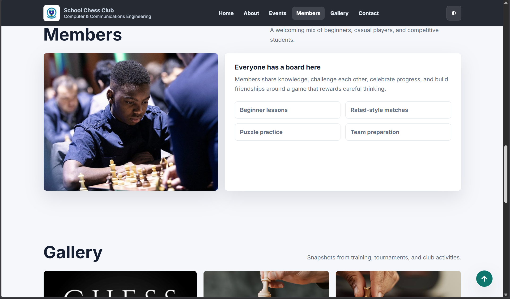
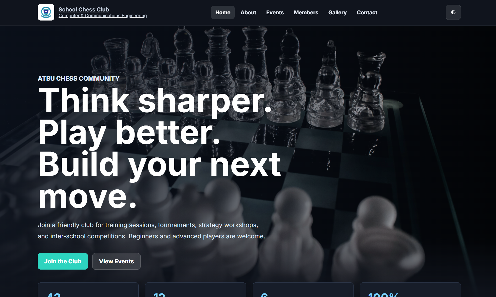

# School Chess Club Website

Welcome to the School Chess Club Website project! This is a simple, modern, and responsive website built for the ATBU Computer & Communications Engineering (CCE) Chess Community.

## Features

- **Modern UI**: Clean design with a responsive layout built using HTML, CSS (with custom properties), and vanilla JavaScript.
- **Dark/Light Mode**: Built-in theme toggle that automatically saves the user's preference in their browser.
- **Dynamic Events**: Events are loaded dynamically from a lightweight Node.js backend.
- **Contact Form**: An interactive form that saves incoming messages to the backend when the server is running.
- **Interactive Statistics**: Animated counters for displaying club statistics.
- **Gallery & Member Highlights**: Showcases the community activities and members.

## Screenshots

<div align="center">
  
  
</div>

## Tech Stack

- **Frontend**: HTML5, CSS3, Vanilla JavaScript
- **Backend**: Node.js (Standard `http` module, no heavy frameworks)

## How to Run Locally

You can run this website locally using the included Node.js server.

1. **Install Node.js**: Ensure you have [Node.js](https://nodejs.org/) installed on your machine.
2. **Clone the repository**:
   ```bash
   git clone https://github.com/YourUsername/CCE512-Chess-Website.git
   cd CCE512-Chess-Website
   ```
3. **Start the server**:
   ```bash
   npm start
   ```
   *Alternatively, you can run `node server.js` directly.*

4. **View the website**: Open your browser and navigate to `http://localhost:3000`.

## Contact Messages

When users fill out the contact form:
- If the backend server is running, messages will be saved locally to `data/messages.json`.
- If the backend isn't reachable, the frontend will temporarily store submissions in the browser's LocalStorage.

## Author

- Samuel Musa (Group 2)
